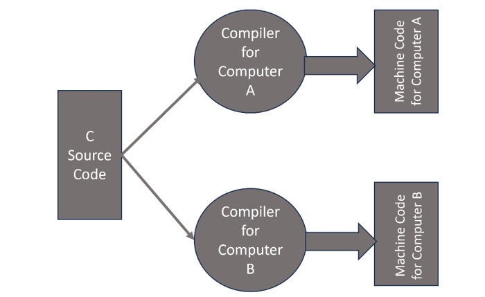

# Compilation Process in C

C is a compiled language. Compiled languages provide faster execution performance as compared to interpreted languages. Different compiler products may be used to compile a C program. They are GCC, Clang, MSVC, etc. In this chapter, we will explain what goes in the background when you compile a C program using GCC compiler.

## Compiling a C Program
A sequence of binary instructions consisting of 1 and 0 bits is called as machine code. High-level programming languages such as C, C++, Java, etc. consist of keywords that are closer to human languages such as English. Hence, a program written in C (or any other high-level language) needs to be converted to its equivalent machine code. This process is called compilation.

Note that the machine code is specific to the hardware architecture and the operating system. In other words, the machine code of a certain C program compiled on a computer with Windows OS will not be compatible with another computer using Linux OS. Hence, we must use the compiler suitable for the target OS.

